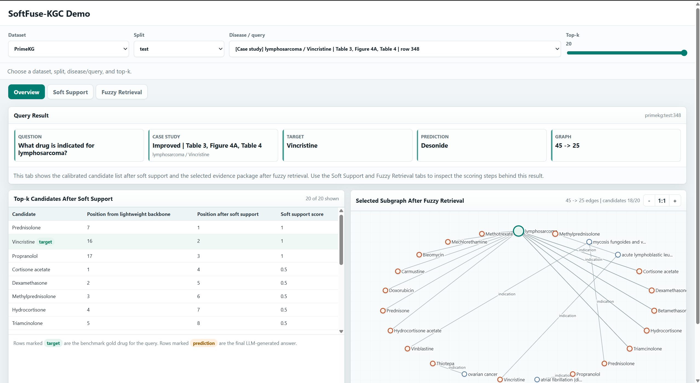

# SoftFuse-KGC

<p align="center">
  
  
  
  
</p>

SoftFuse-KGC is a biomedical knowledge graph completion repository for studying
how lightweight symbolic and graph evidence can improve retrieval-augmented LLM
prediction. The method starts from structure-only top-k candidates, adds
typed soft support signals, and then applies confidence-aware fuzzy retrieval to
select a compact graph context for end-to-end generation.

The code supports a main PrimeKG indication task and transfer experiments on
PharmKG, Hetionet, DRKG, and repoDB. This README explains how to obtain raw data, rebuild intermediate artifacts, and
run candidate-stage and E2E evaluation.

## Web Demo

An interactive demo is available on Hugging Face Spaces:

https://inosuke710-softfuse-kgc-demo.hf.space/

The web server uses precomputed artifacts to inspect the Overview, Soft Support,
and Fuzzy Retrieval tabs across PrimeKG, PharmKG, Hetionet, DRKG, and repoDB.



<video src="https://github.com/dhduong710/SoftFuse-KGC/raw/main/demo_video.mp4" controls width="100%">
  Demo video: https://github.com/dhduong710/SoftFuse-KGC/raw/main/demo_video.mp4
</video>

[Watch the demo video online](https://github.com/dhduong710/SoftFuse-KGC/raw/main/demo_video.mp4)

## Method Overview

```mermaid
flowchart LR
    A["Raw biomedical KG"] --> B["Task preprocessing<br/>splits + graph"]
    B --> C["Backbone candidates<br/>top-20"]
    C --> D["Soft support<br/>typed evidence + constraints"]
    D --> E["Fuzzy retrieval<br/>confidence-aware subgraph"]
    E --> F["Graph-enhanced LLM<br/>train + infer"]
    F --> G["Candidate and E2E metrics"]

    style A fill:#EFF6FF,stroke:#2563EB,stroke-width:2px
    style B fill:#ECFDF5,stroke:#059669,stroke-width:2px
    style C fill:#FFF7ED,stroke:#EA580C,stroke-width:2px
    style D fill:#F5F3FF,stroke:#7C3AED,stroke-width:2px
    style E fill:#FDF2F8,stroke:#DB2777,stroke-width:2px
    style F fill:#FEFCE8,stroke:#CA8A04,stroke-width:2px
    style G fill:#F8FAFC,stroke:#475569,stroke-width:2px
```



| Row | What changes | Main artifact |
|---|---|---|
| `backbone_raw` | Structure-only candidate order and graph context | `dataset/setting_a/backbone_candidates/` |
| `soft_support_raw` | Candidate order is adjusted with typed evidence, direct-link penalties, and contradiction checks | `dataset/setting_a/soft_support_ranked_candidates/` |
| `fuzzy_retrieval_main` | Candidate order is preserved while graph context is compressed by confidence-aware retrieval | `dataset/setting_a/fuzzy_retrieval/` |
| E2E packages | Rows are converted to the `main.py` / `infer.py` contract | `dataset/setting_a/e2e_infer_ready/` |

## Repository Map

| Path | Role |
|---|---|
| `configs/` | PrimeKG backbone, soft-support, and fuzzy-retrieval configurations |
| `data/raw/pharmkg/` | PharmKG-8k raw files used by the PharmKG transfer pipeline |
| `dataset/setting_a/` | PrimeKG main task artifacts |
| `dataset/setting_b/` | PrimeKG annotation and candidate-stage evaluation artifacts |
| `dataset/setting_c_pharmkg/` | PharmKG transfer artifacts |
| `dataset/setting_d_hetionet/` | Hetionet transfer artifacts |
| `dataset/setting_e_drkg/` | DRKG transfer artifacts |
| `dataset/setting_f_repodb/` | repoDB transfer artifacts |
| `scripts/` | Rebuild, scoring, retrieval, transfer, and E2E scripts |
| `main.py` | Graph-enhanced LoRA training |
| `infer.py` | E2E inference and ranking metrics |

Generated logs, checkpoints, and reports are written under `outputs/`.

## Installation

Use Python 3.10 or 3.11. Install the PyTorch build that matches your CUDA
driver before running E2E training.

```bash
conda create -n softfuse-kgc python=3.10 -y
conda activate softfuse-kgc

pip install numpy pandas networkx tqdm pyyaml pyreadr
pip install transformers==4.38.2 peft==0.4.0 accelerate==0.27.2 \
  bitsandbytes==0.40.2 safetensors==0.4.3 tokenizers==0.15.2 \
  datasets==2.20.0

# Example for CUDA 11.8. Change this line for your CUDA runtime.
pip install torch==2.3.1 --index-url https://download.pytorch.org/whl/cu118
```

`pyreadr` is only required for repoDB raw-data export. If it is unavailable,
the repoDB inventory script can also use `Rscript`.

## Raw Data

Run commands from the repository root.

| Dataset | Raw-data command | Expected location |
|---|---|---|
| PrimeKG | Manual download from Dataverse | `dataset/raw/primekg/kg.csv` |
| PharmKG | `python scripts/pharmkg/inventory_raw.py` | `data/raw/pharmkg/PharmKG-8k/` |
| Hetionet | `python scripts/hetionet/inventory_raw.py` | `dataset/setting_d_hetionet/raw_inventory/` |
| DRKG | `python scripts/drkg/inventory_raw.py` | `dataset/setting_e_drkg/raw_inventory/` |
| repoDB | `python scripts/repodb/inventory_raw.py` | `dataset/setting_f_repodb/raw_inventory/` |

PrimeKG raw CSV:

```bash
mkdir -p dataset/raw/primekg
curl -L -o dataset/raw/primekg/kg.csv \
  https://dataverse.harvard.edu/api/access/datafile/6180620
```

The PrimeKG release artifacts in this repository start from the
indication-only task file:

```text
dataset/setting_a/raw_triples/primekg_indication_only.tsv
```

If you regenerate it from `kg.csv`, keep a three-column TSV with header
`head`, `relation`, `tail`, where `relation` is `indication`, `head` is the
drug, and `tail` is the disease.

For PharmKG, the inventory script downloads the PharmKG-8k split files by
default. To additionally inventory the official Zenodo archive:

```bash
python scripts/pharmkg/inventory_raw.py --download-zenodo
```

## Reproducing The PrimeKG Pipeline

The PrimeKG pipeline uses the checked-in preprocessing artifacts under
`dataset/setting_a/` and `dataset/setting_b/`, then rebuilds SoftFuse rows and
metrics from them.

### 1. Preprocessing And Backbone Inputs

The release contains the fixed PrimeKG splits, enriched graph, DrKGC-compatible
ID maps, aligned evidence, backbone candidates, and ontology-control rows.

If an experiment needs the optional train candidate file, export it from the
included aligned train evidence:

```bash
python scripts/backbone/export_primekg_train_candidates.py
```

To rerun structure-only baselines:

```bash
python scripts/baselines/rerun_structure_baselines.py \
  --models transe distmult complex rotate rgcn hrgat

python scripts/baselines/recompute_metrics.py
python scripts/baselines/build_baseline_comparison.py
```

### 2. Soft Support

```bash
python scripts/soft_support/build_support_features.py
python scripts/soft_support/build_soft_support_variants.py
python scripts/soft_support/compare_soft_support_variants.py
python scripts/soft_support/collect_soft_support_variant_cases.py
python scripts/soft_support/select_soft_support_main.py
python scripts/soft_support/build_soft_support_test.py
```

Primary outputs:

```text
dataset/setting_a/support_features/valid_support_features.json
dataset/setting_a/soft_support_ranked_candidates/valid_top20_soft_support_main.json
dataset/setting_a/soft_support_ranked_candidates/test_top20_soft_support_main.json
```

### 3. Fuzzy Retrieval

```bash
python scripts/fuzzy_retrieval/build_path_features.py
python scripts/fuzzy_retrieval/build_fuzzy_retrieval_v1.py
python scripts/fuzzy_retrieval/compare_fuzzy_retrieval_v1.py
python scripts/fuzzy_retrieval/collect_fuzzy_retrieval_v1_cases.py
python scripts/fuzzy_retrieval/build_fuzzy_retrieval_variants.py
python scripts/fuzzy_retrieval/compare_fuzzy_retrieval_variants.py
python scripts/fuzzy_retrieval/collect_fuzzy_retrieval_variant_cases.py
python scripts/fuzzy_retrieval/select_fuzzy_retrieval_main.py
python scripts/fuzzy_retrieval/build_fuzzy_retrieval_test.py
```

Primary outputs:

```text
dataset/setting_a/fuzzy_retrieval/valid_fuzzy_retrieval_main.json
dataset/setting_a/fuzzy_retrieval/test_fuzzy_retrieval_main.json
```

### 4. Candidate-Stage Evaluation

```bash
python scripts/evaluation/build_valid_eval_ready.py
python scripts/evaluation/build_valid_main_table.py
python scripts/evaluation/build_test_eval_ready.py
python scripts/evaluation/build_test_main_table.py
python scripts/evaluation/collect_test_cases.py
```

Primary outputs:

```text
dataset/setting_b/eval_valid/
dataset/setting_b/eval_test/
outputs/evaluation/
```

### 5. E2E Training And Inference

Build `infer.py`-ready packages:

```bash
python scripts/e2e/build_infer_ready.py
```

Train one graph-enhanced LoRA checkpoint:

```bash
export MODEL_NAME_OR_PATH=meta-llama/Llama-3.2-3B

python main.py \
  --dataset_path dataset/setting_a/e2e_infer_ready/backbone_raw \
  --model_name_or_path "$MODEL_NAME_OR_PATH" \
  --model_type llama \
  --kge_embedding_path dataset/setting_a/backbone_ready/entity_embeddings_rgcn.pt \
  --graph_num_rels 4 \
  --output_dir outputs/e2e/e2e_primary_checkpoint \
  --source_max_len 768 \
  --target_max_len 64 \
  --use_quant False \
  --num_train_epochs 1 \
  --per_device_train_batch_size 1 \
  --gradient_accumulation_steps 16 \
  --learning_rate 0.0002 \
  --lr_scheduler_type constant \
  --warmup_ratio 0.03 \
  --lora_r 32 \
  --lora_alpha 32 \
  --lora_dropout 0.1 \
  --remove_unused_columns False \
  --dataloader_num_workers 4 \
  --save_steps 500 \
  --logging_steps 10 \
  --bf16 True \
  --tf32 True \
  --report_to none
```

Run test inference and collect the PrimeKG E2E table:

```bash
bash scripts/e2e/run_backbone_soft_e2e.sh
bash scripts/e2e/run_retrieval_e2e.sh
python scripts/e2e/collect_backbone_soft_e2e.py
python scripts/e2e/collect_retrieval_e2e.py
python scripts/e2e/build_e2e_table.py
```

Optional decoding sweep:

```bash
python scripts/e2e/make_decoding_sweep_configs.py
bash scripts/e2e/run_valid_decoding_sweep.sh
python scripts/e2e/collect_valid_decoding_sweep.py
bash scripts/e2e/run_selected_decode_test.sh
python scripts/e2e/collect_selected_decode_metrics.py
```

## Transfer Experiments

The transfer datasets use the same conceptual order: inventory raw data,
construct the task graph, rerun structure baselines, build SoftFuse-ready
packages, apply soft support, apply fuzzy retrieval, and run E2E inference.

<details>
<summary><strong>PharmKG</strong></summary>

```bash
python scripts/pharmkg/inventory_raw.py
python scripts/pharmkg/select_task_schema.py
python scripts/pharmkg/build_splits_and_graph.py

python scripts/pharmkg/rerun_kge_baselines.py
python scripts/pharmkg/rerun_gnn_baselines.py
python scripts/pharmkg/build_transfer_eval_backbone.py
python scripts/pharmkg/build_softfuse_ready_package.py

python scripts/pharmkg/build_support_features.py
python scripts/pharmkg/build_soft_support_transfer.py
python scripts/pharmkg/build_fuzzy_retrieval_transfer.py
python scripts/pharmkg/build_eval_tables.py

python scripts/pharmkg/e2e/prepare_e2e_ready.py
MODEL_NAME=meta-llama/Llama-3.2-3B bash scripts/pharmkg/e2e/run_train_infer.sh
python scripts/pharmkg/e2e/e2e_metrics.py
```

</details>

<details>
<summary><strong>Hetionet</strong></summary>

```bash
python scripts/hetionet/inventory_raw.py
python scripts/hetionet/build_splits_and_graph.py

python scripts/hetionet/rerun_kge_baselines.py
python scripts/hetionet/rerun_gnn_baselines.py
python scripts/hetionet/select_backbone_source.py
python scripts/hetionet/build_softfuse_ready.py

python scripts/hetionet/build_soft_support.py
python scripts/hetionet/build_fuzzy_retrieval.py

export MODEL_NAME_OR_PATH=meta-llama/Llama-3.2-3B
bash scripts/hetionet/e2e/run_all_rows.sh
python scripts/hetionet/e2e/collect_metrics.py
```

</details>

<details>
<summary><strong>DRKG</strong></summary>

```bash
python scripts/drkg/inventory_raw.py
python scripts/drkg/select_task_schema.py
python scripts/drkg/build_splits_and_graph.py

python scripts/drkg/rerun_kge_baselines.py
python scripts/drkg/rerun_gnn_baselines.py
python scripts/drkg/select_backbone_source.py
python scripts/drkg/build_softfuse_ready.py

python scripts/drkg/build_soft_support.py --source distmult
python scripts/drkg/build_soft_support.py --source rgcn
python scripts/drkg/sweep_soft_support.py
python scripts/drkg/build_fuzzy_retrieval.py

export MODEL_NAME_OR_PATH=meta-llama/Llama-3.2-3B
bash scripts/drkg/e2e/run_rgcn_rows.sh
python scripts/drkg/e2e/collect_metrics.py
```

</details>

<details>
<summary><strong>repoDB</strong></summary>

```bash
python scripts/repodb/inventory_raw.py
python scripts/repodb/select_task_schema.py
python scripts/repodb/build_splits_and_graph.py

python scripts/repodb/rerun_kge_baselines.py
python scripts/repodb/rerun_gnn_baselines.py
python scripts/repodb/select_backbone_source.py
python scripts/repodb/build_softfuse_ready.py

python scripts/repodb/build_soft_support.py
python scripts/repodb/build_raw_display_control.py
python scripts/repodb/build_fuzzy_retrieval.py

export MODEL_NAME_OR_PATH=meta-llama/Llama-3.2-3B
bash scripts/repodb/e2e/run_all_rows.sh
python scripts/repodb/e2e/collect_metrics.py
```

</details>

## Data Sources

| Dataset | Source |
|---|---|
| PrimeKG | https://zitniklab.hms.harvard.edu/projects/PrimeKG/ |
| PrimeKG GitHub | https://github.com/mims-harvard/PrimeKG |
| PrimeKG Dataverse | https://doi.org/10.7910/DVN/IXA7BM |
| PharmKG | https://github.com/biomed-AI/PharmKG |
| PharmKG Zenodo | https://zenodo.org/records/4077338 |
| Hetionet | https://zenodo.org/records/268568 |
| DRKG | https://dgl-data.s3-us-west-2.amazonaws.com/dataset/DRKG/drkg.tar.gz |
| repoDB | https://github.com/adam-sam-brown/repoDB |

## Citation

If you use this repository, please cite the accompanying paper. A BibTeX entry
will be added here once the archival metadata is available.
